## Intro

Todo...

## Index <a name="index"></a>

- [Raspberry Pi 2 W Information](#raspberry-pi-two-w-info)
- [Raspberry Pi 2 W OS Setup](#pi-os-setup)
- [Screen Module](#screen-module)
- [Battery Module](#battery-module)
- [Pi OS Upgrade](#pi-os-upgrade)

## Raspberry Pi Zero 2 W Information <a name="raspberry-pi-two-w-info"></a>

"Building on the success of the current Zero family, Raspberry Pi Zero 2 W is built around a Raspberry Pi-designed System-in-Package, which integrates the BCM2710A1 die used in Raspberry Pi 3 with 512MB of RAM."

Features:
- 1GHz quad-core, 64-bit ARM Cortex-A53 CPU
- VideoCore IV GPU
- 512MB LPDDR2 DRAM
- 802.11b/g/n wireless LAN
- Bluetooth 4.2 / Bluetooth Low Energy (BLE)
- MicroSD card slot
- Mini HDMI and USB 2.0 OTG ports
- Micro USB power
- HAT-compatible 40-pin header
- Composite video and reset pins via solder test points
- CSI camera connector

Purchase: 

- https://www.pishop.us/product/raspberry-pi-zero-2-w/

Documents: 

- https://www.raspberrypi.com/documentation/computers/getting-started.html

- https://datasheets.raspberrypi.com/rpizero2/raspberry-pi-zero-2-w-product-brief.pdf

<p align="center">
  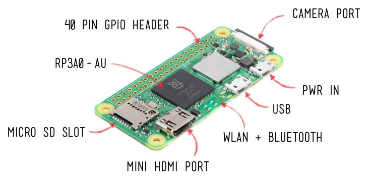
</p>

<p align="center">
  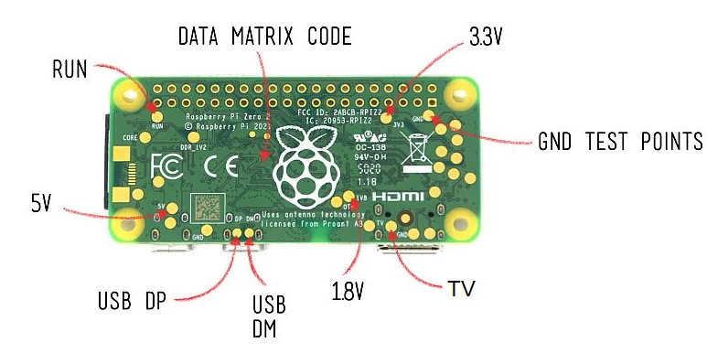
</p>

> ![Info][img-info] Images courtesy of [pi3g][url-pi3g]

<p align="right">[ <a href="#index">Index</a> ]</p>

## Pi OS Setup <a name="pi-os-setup"></a>

1. Download the Raspberry Pi Imager: https://www.raspberrypi.com/software/

2. Plug the microSD card into the computer and open the Raspberry Pi Imager.

3. We'll install the full Raspberry Pi OS (32-bit) in this example so we can take advantage of our massive 1.3inch IPS LCD display HAT:

> ![Info][img-info] Before installation enable SSH, take note of the hostname, set the username and password for the Raspberry Pi Zero, and set up your connection to the Wi-Fi network.

<details>
  <summary>Installation Images (click to expand)</summary>

  <p align="center">
    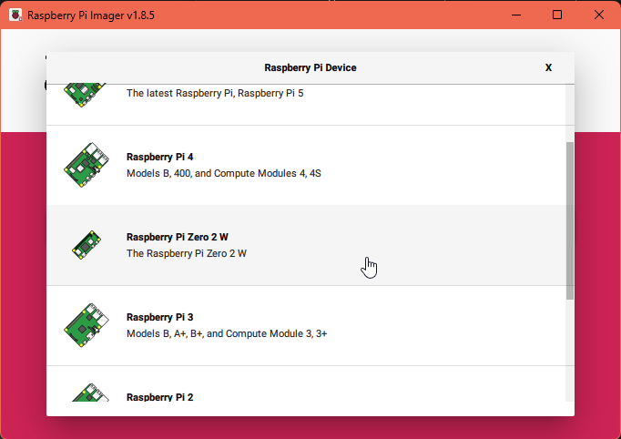
  </p>
  <p align="center">
    
  </p>
  <p align="center">
    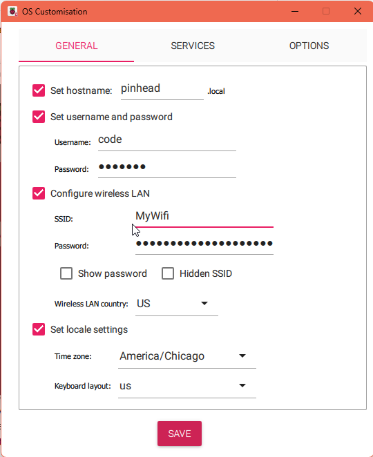
  </p>
  <p align="center">
    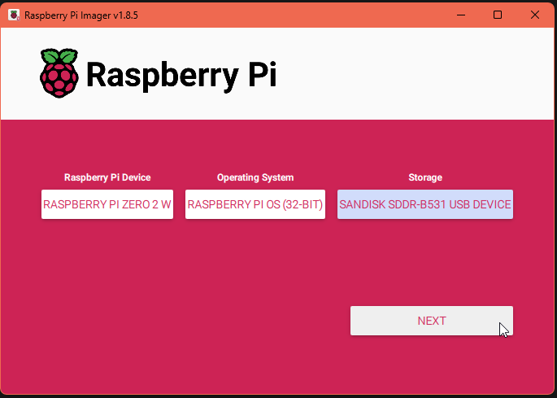
  </p>
  <p align="center">
    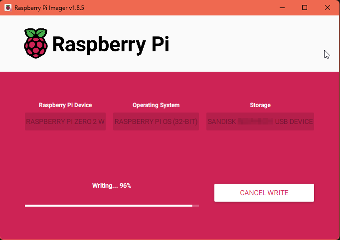
  </p>
  <p align="center">
    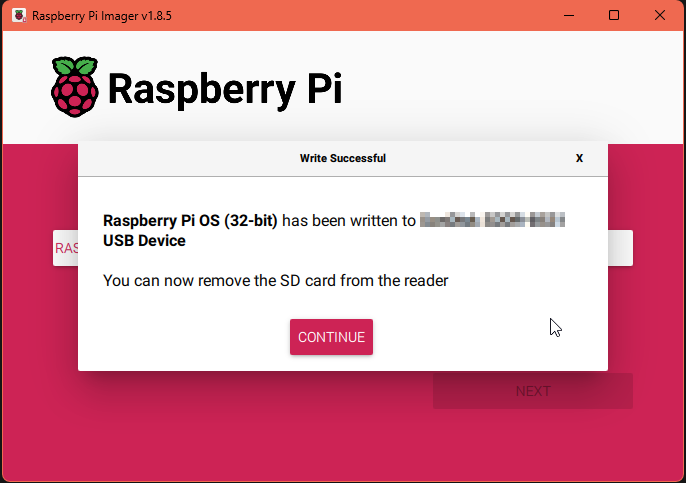
  </p>
</details>

4. After the installation is complete, open the microSD card on your computer and then the `config.txt` file. Add the following to the end of the file:

  ```bash
  # 1.3inch IPS LCD display HAT
  hdmi_force_hotplug=1
  hdmi_cvt=300 300 60 1 0 0 0
  hdmi_group=2
  hdmi_mode=87
  display_rotate=0
  gpio=6,19,5,26,13,21,20,16=pu

  # Enable USB OTG port
  dtoverlay=dwc2

  # Be sure to comment out any existing driver lines, ie.
  # dtoverlay=vc4-kms-v3d
  # max_framebuffers=2
  ```

5. Save and close `config.txt`. 

6. In the same directory, open the file `cmdline.txt` and add `modules-load=dwc2,g_ether` after `rootwait`. Ensure it remains a single line of text, and has proper spacing. For example:

  ```bash
  ... rootwait modules-load=dwc2,g_ether ...
  ```

7. Save and close `cmdline.txt`. 

8. Remove the microSD card from the computer and insert it into the Raspberry Pi Zero.

9. Connect the Raspberry Pi Zero to the computer using a USB cable. Connect the cable to the USB port in the center of the Raspberry Pi Zero labeled `USB`. The green LED will light up, indicating the Raspberry Pi Zero is powered on.

  > ![Info][img-info] The Raspberry Pi Zero will appear as a USB Ethernet device on the computer.

10. Open the terminal and run the following command to access the Raspberry Pi Zero. Using the hostname and the username and password you set during the installation:

  ```bash
  ssh code@pinhead.local
  ```

11. Update the system:

  ```bash
  sudo apt-get update
  ```

12. Reboot the Raspberry Pi Zero once more to apply the changes:

  ```bash
  sudo reboot
  # Reconnect to the Raspberry Pi Zero
  ssh code@pinhead.local
  ```

13. Continue with the installation of the screen and battery modules below.

<p align="right">[ <a href="#index">Index</a> ]</p>

## Screen Module <a name="screen-module"></a>

**240x240, 1.3inch IPS LCD display HAT**

Purchase: 

- https://www.pishop.us/product/240x240-1-3inch-ips-lcd-display-hat-for-raspberry-pi/

Documentation: 

- https://www.waveshare.com/wiki/1.3inch_LCD_HAT

### Pi OS Configuration

Open the terminal:

  ```bash
  sudo raspi-config
  Choose Interface Options -> SPI -> Yes  to enable SPI interface
  ```

<details>
  <summary>Config setup Images (click to expand)</summary>

  <p align="center">
    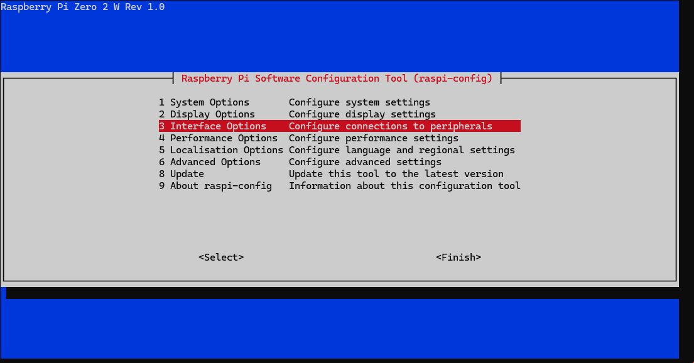
  </p>

  <p align="center">
    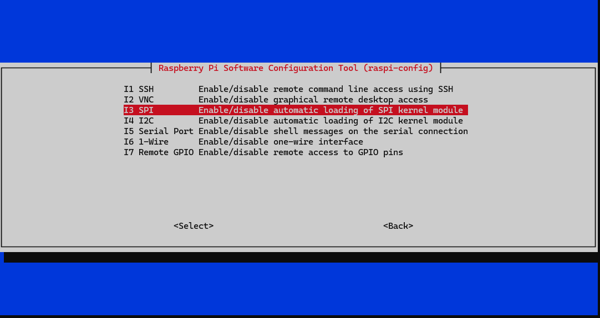
  </p>

  <p align="center">
    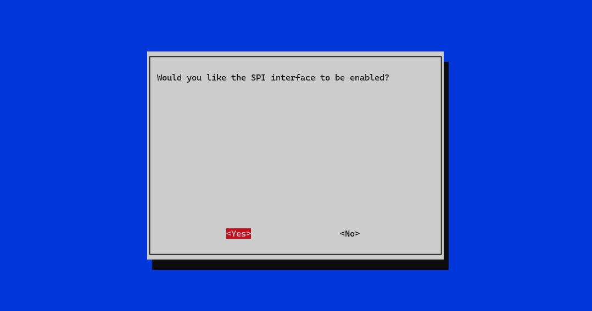
  </p>

  <p align="center">
    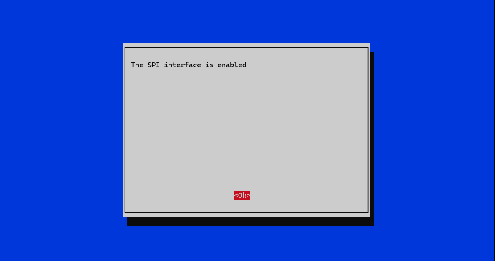
  </p>

  <p align="center">
    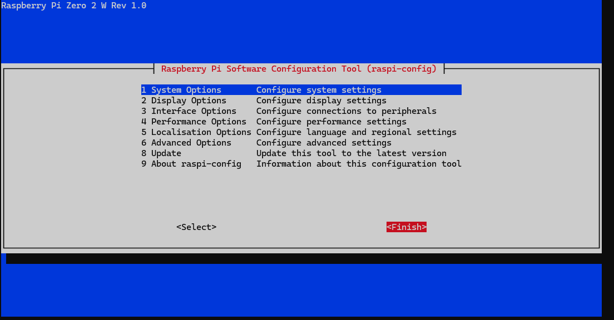
  </p>
</details>

Ensure your user has the necessary permissions to access the SPI device:

  ```bash
  sudo usermod -aG spi,gpio $(whoami)
  ```

Reboot Raspberry Pi：
  
  ```bash
  sudo reboot
  # Reconnect to the Raspberry Pi Zero
  ssh code@pinhead.local
  ```

### Software Installation

  ```bash
  wget https://github.com/joan2937/lg/archive/master.zip
  unzip master.zip
  cd lg-master
  sudo make install
  ```

### Download Examples

Open the Raspberry Pi terminal and run the following command:

  ```bash
  sudo apt-get install p7zip-full -y
  wget https://files.waveshare.com/upload/b/bd/1.3inch_LCD_HAT_code.7z
  7z x 1.3inch_LCD_HAT_code.7z -r -o./1.3inch_LCD_HAT_code
  sudo chmod 777 -R 1.3inch_LCD_HAT_code
  cd 1.3inch_LCD_HAT_code
  ```

Run the demo:

  ```bash
  cd 1.3inch_LCD_HAT_code/python
  # This will show an image on the screen for a few seconds. Press Ctrl+C to exit
  sudo python main.py
  # This will show another image on the screen for a few seconds. Press Ctrl+C to exit
  sudo python key_demo.py
  ```

After confirming the demos, you can now compile and run the screen firmware. First we need to install the necessary dependencies:

  > ![Info][img-info] You will need to increase your swap size to 2GB to speed up the upgrade process. Follow the steps in the [Setup speed increase](#setup-speed-increase) section below.

  ```bash
  cd ~
  # This will take a few minutes to complete.
  sudo apt-get install cmake -y
  sudo apt-get install libraspberrypi-dev -y
  sudo apt-get install p7zip-full -y
  wget https://files.waveshare.com/upload/f/f9/Waveshare_fbcp.7z
  7z x Waveshare_fbcp.7z -o./waveshare_fbcp
  cd waveshare_fbcp
  mkdir build
  cd build
  ```

Use the following commands to compile the software:

  ```bash
  cmake -DSPI_BUS_CLOCK_DIVISOR=20 -DWAVESHARE_1INCH3_LCD_HAT=ON -DBACKLIGHT_CONTROL=ON -DSTATISTICS=0 ..
  make -j
  sudo ./fbcp
  ```

Auto-start when Power on:

  ```bash
  sudo cp ~/waveshare_fbcp/build/fbcp /usr/local/bin/fbcp
  sudo nano /etc/rc.local
  ```

Then add `fbcp&` on the line above and before `exit 0`, as the picture below:

<p align="center">
  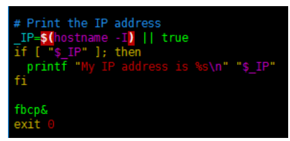
</p>

After you're done making edits press `Ctrl+X`, then `Y`, and then `Enter` to save and exit. Then reboot the Raspberry Pi Zero:

  ```bash
  sudo reboot
  # Reconnect to the Raspberry Pi Zero
  ssh code@pinhead.local
  ```

<p align="right">[ <a href="#index">Index</a> ]</p>

## Battery Module <a name="battery-module"></a>

**Uninterruptible Power Supply UPS HAT**

Purchase: 

- https://www.pishop.us/product/uninterruptible-power-supply-ups-hat-for-raspberry-pi-zero-stable-5v-power-output/

Documentation: 

- https://www.waveshare.com/wiki/UPS_HAT_(C)

### Pi OS Configuration

Open the terminal:

  ```bash
  sudo raspi-config 
  Choose Interfacing Options -> I2C -> Yes to enable I2C interface 
  ```

<details>
  <summary>Config setup Images (click to expand)</summary>

  <p align="center">
    
  </p>

  <p align="center">
    
  </p>

  <p align="center">
    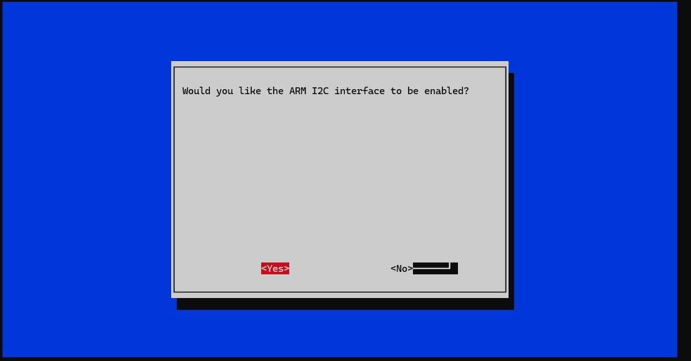
  </p>

  <p align="center">
    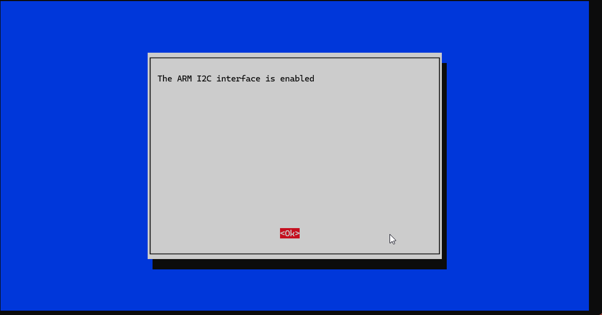
  </p>

  <p align="center">
    
  </p>
</details>

Then reboot the Pi Zero:

  ```bash
  sudo reboot
  # Reconnect to the Raspberry Pi Zero
  ssh code@pinhead.local
  ```

### Software Installation

  ```bash
  # Install the p7zip package to handle 7z archives
  sudo apt-get install p7zip

  # Download the UPS HAT software archive from the Waveshare website
  wget https://files.waveshare.com/upload/4/40/UPS_HAT_C.7z

  # Extract the downloaded 7z archive to the current directory
  7zr x UPS_HAT_C.7z -r -o./
  ```

### Run the UPS HAT software

  ```bash
  # Change directory to the newly created directory containing the extracted files
  cd UPS_HAT_C

  # Run the Python script named 'INA219.py', which typically handles the monitoring of the UPS
  python3 INA219.py
  ```

  > ![Info][img-info] If the current value is negative, it means that the batteries are feeding the Raspberry Pi. If the current value is positive, it means that the batteries are charging.

<p align="right">[ <a href="#index">Index</a> ]</p>

## Pi OS Upgrade <a name="pi-os-upgrade"></a>

To upgrade the Raspberry Pi OS, follow these steps:

> ![Info][img-info] You will need to increase your swap size to 2GB to speed up the upgrade process. Follow the steps in the [Setup speed increase](#setup-speed-increase) section below.

  ```bash
  # Update the system
  sudo apt-get update
  # Upgrade the system, this step may take some time and may appear to hang at times
  sudo apt-get upgrade
  ```

<p align="right">[ <a href="#index">Index</a> ]</p>

## Setup speed increase (for installs) <a name="setup-speed-increase"></a>

If you want to speed up the installation process, you can increase the swap size temporarily. To do this, follow these steps:

  ```bash
  # Check current swap size (should see 100Mi or 99Mi for total)
  free -h
  # Disable current swap
  sudo dphys-swapfile swapoff
  # Set the swap file size to 2GB
  sudo sed -i 's/^CONF_SWAPSIZE=.*/CONF_SWAPSIZE=2048/' /etc/dphys-swapfile
  # Recreate the swap file with the new size
  sudo dphys-swapfile setup
  # Enable the new swap size
  sudo dphys-swapfile swapon
  # Reboot
  sudo reboot
  # Reconnect to the Raspberry Pi Zero
  ssh code@pinhead.local
  # Verify the new swap size (should be 2GB)
  free -h
  ```

Continue with your installations.

After the installation(s) are complete, you can reset the swap size to the default value:

  ```bash
  # Disable current swap
  sudo dphys-swapfile swapoff
  # Set the swap file size back to 100MB
  sudo sed -i 's/^CONF_SWAPSIZE=.*/CONF_SWAPSIZE=100/' /etc/dphys-swapfile
  # Recreate the swap file with the original size
  sudo dphys-swapfile setup
  # Enable the original swap size
  sudo dphys-swapfile swapon
  # Reboot
  sudo reboot
  # Reconnect to the Raspberry Pi Zero
  ssh code@pinhead.local
  # Verify the reverted swap size (should be 100MB)
  free -h
  ```

<p align="right">[ <a href="#index">Index</a> ]</p>

## Thanks!

Cody Tolene

<!-- IMAGE REFERENCES -->

[img-info]: .github/images/info.svg
[img-warning]: .github/images/warn.svg

<!-- LINK REFERENCES -->

[url-pi3g]: https://www.pi3g.com
