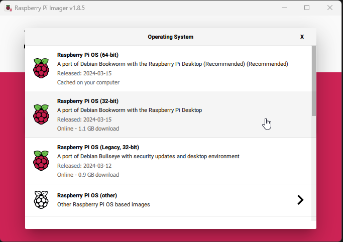
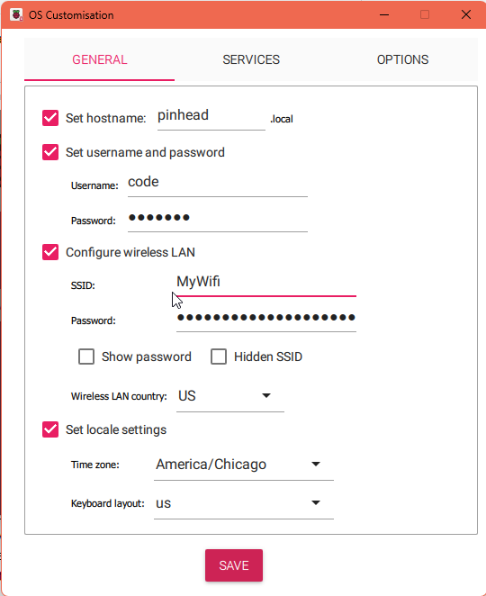
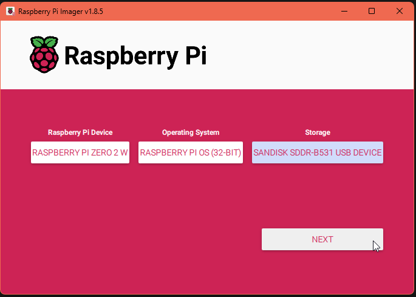
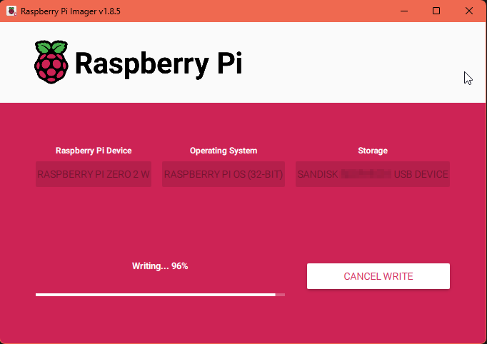
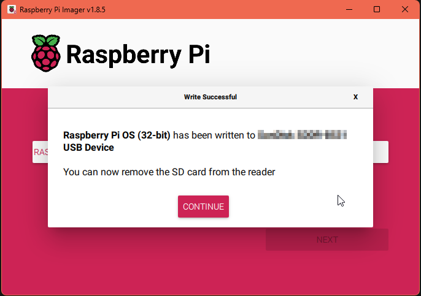

## Intro

Todo...

This repository is not yet ready for use, please check back later!

For the latest updates, please visit the development branch:

https://github.com/CodyTolene/Pocket-Pi/tree/development

<!---------------------------------------------------------------------------->
<!---------------------------------------------------------------------------->
<!---------------------------------------------------------------------------->

## Index <a name="index"></a>

- [Raspberry Pi 2 W Information](#raspberry-pi-two-w-info)
- [Raspberry Pi 2 W OS Setup](#pi-os-setup)
- [MicroSD Card Setup & PC Connection (SSH)](#sd-card-setup-and-pc-connection)
- [Increasing Swap Size](#increasing-swap-size)
- [Updating, Upgrading, and Dependencies](#updating-upgrading-dependencies)
- [Screen Module Setup](#screen-module-setup)
- [Battery Module Setup](#battery-module-setup)
- [Licensing](#licensing)
- [Wrapping Up](#wrapping-up)

<!---------------------------------------------------------------------------->
<!---------------------------------------------------------------------------->
<!---------------------------------------------------------------------------->

## Raspberry Pi Zero 2 W Information <a name="raspberry-pi-two-w-info"></a>

"Building on the success of the current Zero family, Raspberry Pi Zero 2 W is built around a Raspberry Pi-designed System-in-Package, which integrates the BCM2710A1 die used in Raspberry Pi 3 with 512MB of RAM."

Features:
- 1GHz quad-core, 64-bit ARM Cortex-A53 CPU
- VideoCore IV GPU
- 512MB LPDDR2 DRAM
- 802.11b/g/n wireless LAN
- Bluetooth 4.2 / Bluetooth Low Energy (BLE)
- MicroSD card slot
- Mini HDMI and USB 2.0 OTG ports
- Micro USB power
- HAT-compatible 40-pin header
- Composite video and reset pins via solder test points
- CSI camera connector

Purchase: 

- https://www.pishop.us/product/raspberry-pi-zero-2-w/

Documents: 

- https://www.raspberrypi.com/documentation/computers/getting-started.html

- https://datasheets.raspberrypi.com/rpizero2/raspberry-pi-zero-2-w-product-brief.pdf

<p align="center">
  
</p>

<p align="center">
  
</p>

> ![Info][img-info] Images courtesy of [pi3g][url-pi3g]

<p align="right">[ <a href="#index">Index</a> ]</p>

<!---------------------------------------------------------------------------->
<!---------------------------------------------------------------------------->
<!---------------------------------------------------------------------------->

## Raspberry Pi Zero 2 W OS Setup <a name="pi-os-setup"></a>

1. Download the Raspberry Pi Imager: https://www.raspberrypi.com/software/

2. Plug the microSD card into the computer and open the Raspberry Pi Imager.

3. We'll install the full Raspberry Pi OS (Bookworm, 32-bit) in this example so we can take advantage of our massive 1.3inch IPS LCD display HAT:

> ![Info][img-info] Before installation enable SSH, take note of the hostname, set the username and password for the Raspberry Pi Zero, and set up your connection to the Wi-Fi network.

<details>
  <summary>Installation Images (click to expand)</summary>

  <p align="center">
    
  </p>
  <p align="center">
    
  </p>
  <p align="center">
    
  </p>
  <p align="center">
    
  </p>
  <p align="center">
    
  </p>
  <p align="center">
    
  </p>
</details>

<p align="right">[ <a href="#index">Index</a> ]</p>

<!---------------------------------------------------------------------------->
<!---------------------------------------------------------------------------->
<!---------------------------------------------------------------------------->

## MicroSD Card Setup & PC Connection (SSH) <a name="sd-card-setup-and-pc-connection"></a>

1. With the microSD card still in your computer, open the `config.txt` file. Add the following to the end of the file:

  ```bash
  # Add these new settings for the 1.3inch IPS LCD display HAT
  hdmi_force_hotplug=1
  hdmi_cvt=300 300 60 1 0 0 0
  hdmi_group=2
  hdmi_mode=87
  display_rotate=0
  gpio=6,19,5,26,13,21,20,16=pu

  # Enable USB OTG port (SSH and Ethernet over USB)
  dtoverlay=dwc2
  ```

2. Uncomment the existing lines to enable SPI and I2C interfaces, make sure they're set to "on":

  ```bash
  dtparam=i2c_arm=on
  dtparam=spi=on
  ```

3. Make sure to comment out the following lines:

  ```bash
    # dtoverlay=vc4-kms-v3d
    # max_framebuffers=2
  ```

4. Save and close `config.txt`. 

5. In the same directory, open the file `cmdline.txt` and add `modules-load=dwc2,g_ether` after `rootwait`. Ensure it remains a single line of text, and has proper spacing. For example:

  ```bash
  ... rootwait modules-load=dwc2,g_ether ...
  ```

  > ![Info][img-info] This is part of enabling SSH and Ethernet over USB.

6. Save and close `cmdline.txt`. 

7. Create a new file named `ssh` in the root of the microSD card. This is part of enabling SSH on the Raspberry Pi Zero.

8. Remove the microSD card from the computer and insert it into the Raspberry Pi Zero.

9. Plug the Raspberry Pi Zero into the computer using a USB cable. Connect the cable to the USB port in the center of the Raspberry Pi Zero labeled `USB`. The green LED will light up, indicating the Raspberry Pi Zero is powered on. 

10. You should now be able to connect to your Pi using SSH:

  ```bash
  # Replace "code@pinhead.local" with your own `hostname` and `username`.
  ssh code@pinhead.local
  ```

<p align="right">[ <a href="#index">Index</a> ]</p>

<!---------------------------------------------------------------------------->
<!---------------------------------------------------------------------------->
<!---------------------------------------------------------------------------->

## Increasing Swap Size <a name="increasing-swap-size"></a>

Increasing the swap size can help speed up the installation process and various other things. This is especially useful when installing software that requires a lot of memory, such as the Raspberry Pi OS update and upgrade process. The default swap size is 100MiB, which is not enough for some installations. Below we will change this to 2GiB (2048MiB). To do this, follow these steps:

  > ![Info][img-info] You can revert this at a later point if you wish or keep it. See "Reverting back to 100MiB" below.

  ```bash
  # Check current swap size (you should see 100MiB or 99MiB for "total")
  free -h
  # Disable current swap
  sudo dphys-swapfile swapoff
  # Set the swap file size to 2048MiB, or 2GiB
  sudo sed -i 's/^CONF_SWAPSIZE=.*/CONF_SWAPSIZE=2048/' /etc/dphys-swapfile
  # Recreate the swap file with the new size
  sudo dphys-swapfile setup
  # Enable the new swap size
  sudo dphys-swapfile swapon
  # Reboot
  sudo reboot
  # Reconnect to the Raspberry Pi Zero
  ssh code@pinhead.local
  # Verify the new swap size (should be 2048MiB, or 2GiB)
  free -h
  ```

<details>
  <summary>Reverting back to 100MiB (click to expand)</summary>

  ```bash
  # Disable current swap
  sudo dphys-swapfile swapoff
  # Set the swap file size back to 100MiB
  sudo sed -i 's/^CONF_SWAPSIZE=.*/CONF_SWAPSIZE=100/' /etc/dphys-swapfile
  # Recreate the swap file with the original size
  sudo dphys-swapfile setup
  # Enable the original swap size
  sudo dphys-swapfile swapon
  # Reboot
  sudo reboot
  # Reconnect to the Raspberry Pi Zero
  ssh code@pinhead.local
  # Verify the reverted swap size (you should be 100MiB or 99MiB)
  free -h
  ```
</details>

<p align="right">[ <a href="#index">Index</a> ]</p>

<!---------------------------------------------------------------------------->
<!---------------------------------------------------------------------------->
<!---------------------------------------------------------------------------->

## Updating, Upgrading, and Dependencies <a name="updating-upgrading-dependencies"></a>

In this section we will update and upgrade the Raspberry Pi Zero to ensure we have the latest software and security updates.

1. Open the terminal and run the following command to access the Raspberry Pi Zero. Using the hostname and the username and password you set during the installation:

  ```bash
  ssh code@pinhead.local
  ```

2. Update & upgrade the system (the y flag will automatically answer yes to any prompts)

  ```bash
  sudo apt-get update && sudo apt-get full-upgrade -y
  ```

3. Install the necessary dependencies for the modules in the upcoming steps

  ```bash
  sudo apt-get install python3-pip python3-pil python3-numpy python3-spidev -y
  sudo apt-get install p7zip-full cmake -y
  sudo apt-get install libraspberrypi-dev raspberrypi-kernel-headers -y
  ```

4. Reboot the Raspberry Pi Zero

  ```bash
  sudo reboot
  ```

<p align="right">[ <a href="#index">Index</a> ]</p>

<!---------------------------------------------------------------------------->
<!---------------------------------------------------------------------------->
<!---------------------------------------------------------------------------->

## Screen Module Setup <a name="screen-module-setup"></a>

**240x240, 1.3inch IPS LCD display HAT**

Purchase: 

- https://www.pishop.us/product/240x240-1-3inch-ips-lcd-display-hat-for-raspberry-pi/

Documentation: 

- https://www.waveshare.com/wiki/1.3inch_LCD_HAT

### Pi OS Configuration

Connect to the Raspberry Pi Zero via SSH:

  ```bash
  ssh code@pinhead.local
  ```

Run the following commands to enable the SPI interface. It should already be enabled if you followed the SD card setup, but it's good to make sure.

  ```bash
  sudo raspi-config
  Choose Interface Options -> SPI -> Yes
  ```

<details>
  <summary>Config setup Images (click to expand)</summary>

  <p align="center">
    
  </p>

  <p align="center">
    
  </p>

  <p align="center">
    
  </p>

  <p align="center">
    
  </p>

  <p align="center">
    
  </p>
</details>

Ensure your user has the necessary permissions to access the SPI device:

  ```bash
  sudo usermod -aG spi,gpio $(whoami)
  ```

Reboot Raspberry Pi：
  
  ```bash
  sudo reboot
  # Reconnect to the Raspberry Pi Zero
  ssh code@pinhead.local
  ```

### Software Installation

  ```bash
  cd ~
  wget https://github.com/joan2937/lg/archive/master.zip
  unzip master.zip
  cd lg-master
  sudo make install
  ```

### Download Examples

Open the Raspberry Pi terminal and run the following command:

  ```bash
  wget https://files.waveshare.com/upload/b/bd/1.3inch_LCD_HAT_code.7z
  7z x 1.3inch_LCD_HAT_code.7z -r -o./1.3inch_LCD_HAT_code
  sudo chmod 777 -R 1.3inch_LCD_HAT_code
  ```

Run the demo:

  ```bash
  # Change directory to where the Python demo code is located
  cd 1.3inch_LCD_HAT_code/1.3inch_LCD_HAT_code/python
  # This will show an image on the screen for a few seconds.
  sudo python main.py
  # This will show another image on the screen. 
  # You should test your screens buttons now as well. If all looks good, press `Ctrl+C` to quit.
  sudo python key_demo.py
  ```

After confirming the demos, you can now compile and run the screen firmware:

  ```bash
  cd ~
  wget https://files.waveshare.com/upload/f/f9/Waveshare_fbcp.7z
  7z x Waveshare_fbcp.7z -o./waveshare_fbcp
  cd waveshare_fbcp
  mkdir build
  cd build
  ```

Use the following commands to compile the software for the 1.3 inch screen:

  ```bash
  cmake -DSPI_BUS_CLOCK_DIVISOR=20 -DWAVESHARE_1INCH3_LCD_HAT=ON -DBACKLIGHT_CONTROL=ON -DSTATISTICS=0 ..
  make -j
  # Test the screen, it will display a "_" on screen for a bit. press `Ctrl+C` to quit.
  sudo ./fbcp
  ```

Auto-start when Power on:

  ```bash
  sudo cp ~/waveshare_fbcp/build/fbcp /usr/local/bin/fbcp
  sudo nano /etc/rc.local
  ```

Then add `fbcp&` on the line above and before `exit 0`, as the picture below:

<p align="center">
  
</p>

After you're done making edits press `Ctrl+X`, then `Y`, and then `Enter` to save and exit. Then reboot the Raspberry Pi Zero:

  ```bash
  sudo reboot
  # Reconnect to the Raspberry Pi Zero
  ssh code@pinhead.local
  ```

<p align="right">[ <a href="#index">Index</a> ]</p>

<!---------------------------------------------------------------------------->
<!---------------------------------------------------------------------------->
<!---------------------------------------------------------------------------->

## Battery Module Setup <a name="battery-module-setup"></a>

**Uninterruptible Power Supply UPS HAT**

Purchase: 

- https://www.pishop.us/product/uninterruptible-power-supply-ups-hat-for-raspberry-pi-zero-stable-5v-power-output/

Documentation: 

- https://www.waveshare.com/wiki/UPS_HAT_(C)

### Pi OS Configuration

Run the following commands to enable the I2C interface. It should already be enabled if you followed the SD card setup, but it's good to make sure.

  ```bash
  sudo raspi-config 
  Choose Interfacing Options -> I2C -> Yes
  ```

<details>
  <summary>Config setup Images (click to expand)</summary>

  <p align="center">
    
  </p>

  <p align="center">
    
  </p>

  <p align="center">
    
  </p>

  <p align="center">
    
  </p>

  <p align="center">
    
  </p>
</details>

Then reboot the Pi Zero:

  ```bash
  sudo reboot
  # Reconnect to the Raspberry Pi Zero
  ssh code@pinhead.local
  ```

### Software Installation

  ```bash
  # Download the UPS HAT software archive from the Waveshare website
  wget https://files.waveshare.com/upload/4/40/UPS_HAT_C.7z

  # Extract the downloaded 7z archive to the current directory
  7zr x UPS_HAT_C.7z -r -o./
  ```

### Run the UPS HAT software

  ```bash
  # Change directory to the newly created directory containing the extracted files
  cd UPS_HAT_C

  # Run the Python script named 'INA219.py', which typically handles the monitoring of the UPS
  python3 INA219.py
  ```

  > ![Info][img-info] If the current value is negative, it means that the batteries are feeding the Raspberry Pi. If the current value is positive, it means that the batteries are charging.

<p align="right">[ <a href="#index">Index</a> ]</p>

<!---------------------------------------------------------------------------->
<!---------------------------------------------------------------------------->
<!---------------------------------------------------------------------------->

## Licensing <a name="licensing"></a>

This project is licensed under the Apache License, Version 2.0. See the [APACHE_2_LICENSE](LICENSE) file for the pertaining license text.

`SPDX-License-Identifier: Apache-2.0`

<p align="right">[ <a href="#index">Index</a> ]</p>


<!---------------------------------------------------------------------------->
<!---------------------------------------------------------------------------->
<!---------------------------------------------------------------------------->

## Wrapping Up <a name="wrapping-up"></a>

Thanks to all the people and projects that made this possible! I hope you enjoy this project as much as I enjoyed working on it. If you have any questions, please let me know by opening an issue [here][issues-link].

| Type                                                                      | Info                                                                      |
| :------------------------------------------------------------------------ | :------------------------------------------------------------------------ |
|                 | webmaster@codytolene.com                                                  |
|      | https://www.buymeacoffee.com/codytolene                                   |
|  | [bc1qfx3lvspkj0q077u3gnrnxqkqwyvcku2nml86wmudy7yf2u8edmqq0a5vnt][url-btc] |

Fin. Happy programming friend!

Cody Tolene

<!---------------------------------------------------------------------------->
<!---------------------------------------------------------------------------->
<!---------------------------------------------------------------------------->

<!-- IMAGE REFERENCES -->

[img-info]: .github/images/ng-icons/info.svg
[img-warning]: .github/images/ng-icons/warn.svg

<!-- LINK REFERENCES -->

[url-btc]: https://explorer.btc.com/btc/address/bc1qfx3lvspkj0q077u3gnrnxqkqwyvcku2nml86wmudy7yf2u8edmqq0a5vnt
[url-pi3g]: https://www.pi3g.com

<!---------------------------------------------------------------------------->
<!---------------------------------------------------------------------------->
<!---------------------------------------------------------------------------->
