<div align="center">
  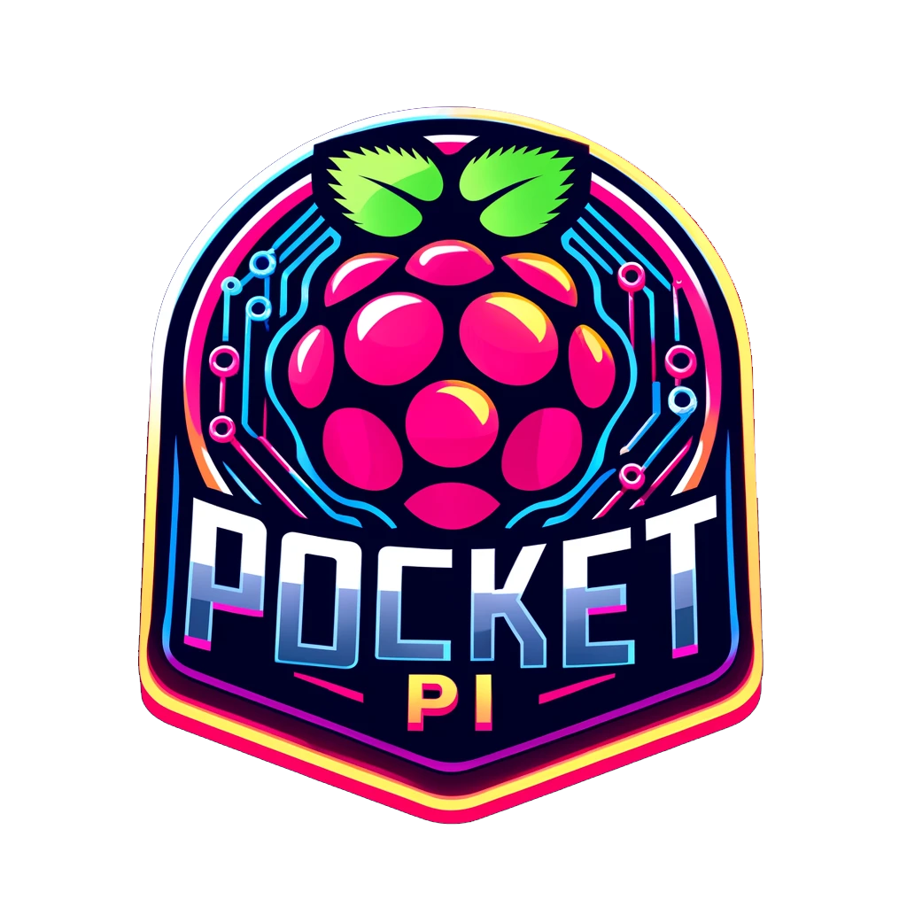
  <h2 align="center">Pocket Pi</h2>
  <p align="center">
    A simple guide to setting up a Raspberry Pi Zero 2 W with a 1.3inch IPS LCD display HAT, joystick, buttons, and battery module.
  </p>
  <p align="center">
    Run a full Raspberry Pi OS in the palm of your hand!
  </p>
</div>

## Index <a name="index"></a>

- [Video Preview](#video-preview)
- [Parts List](#parts-list)
- [Raspberry Pi 2 W Information](#raspberry-pi-two-w-info)
- [Raspberry Pi 2 W OS Setup](#pi-os-setup)
- [MicroSD Card Setup & PC Connection (SSH)](#sd-card-setup-and-pc-connection)
- [Increasing Swap Size](#increasing-swap-size)
- [Updating & Upgrading](#updating-upgrading)
- [Screen Module Setup](#screen-module-setup)
- [Joystick and Buttons Setup](#joystick-and-buttons-setup)
- [Battery Module Setup](#battery-module-setup)
- [Licensing](#licensing)
- [Useful Commands](#useful-commands)
- [Wrapping Up](#wrapping-up)

<!---------------------------------------------------------------------------->
<!---------------------------------------------------------------------------->
<!---------------------------------------------------------------------------->

## Video Preview <a name="video-preview"></a>


<p align="right">[ <a href="#index">Index</a> ]</p>

<!---------------------------------------------------------------------------->
<!---------------------------------------------------------------------------->
<!---------------------------------------------------------------------------->

## Parts List <a name="parts-list"></a>

| Part                                                        | Price (USD) |
| :---------------------------------------------------------- | :---------- |
| [Raspberry Pi Zero 2 W][url-pi-zero]                        | $15.00      |
| [240x240, 1.3inch IPS LCD display HAT][url-pi-lcd-hat]      | $14.95      |
| [Uninterruptible Power Supply UPS HAT][url-pi-power-supply] | $27.95      |
| 3D Printed Case (coming soon!)                              | ...         |

<p align="right">[ <a href="#index">Index</a> ]</p>

<!---------------------------------------------------------------------------->
<!---------------------------------------------------------------------------->
<!---------------------------------------------------------------------------->

## Raspberry Pi Zero 2 W Information <a name="raspberry-pi-two-w-info"></a>

"Building on the success of the current Zero family, Raspberry Pi Zero 2 W is built around a Raspberry Pi-designed System-in-Package, which integrates the BCM2710A1 die used in Raspberry Pi 3 with 512MB of RAM."

Features:
- 1GHz quad-core, 64-bit ARM Cortex-A53 CPU
- VideoCore IV GPU
- 512MB LPDDR2 DRAM
- 802.11b/g/n wireless LAN
- Bluetooth 4.2 / Bluetooth Low Energy (BLE)
- MicroSD card slot
- Mini HDMI and USB 2.0 OTG ports
- Micro USB power
- HAT-compatible 40-pin header
- Composite video and reset pins via solder test points
- CSI camera connector

Purchase: 

- [https://www.pishop.us/product/raspberry-pi-zero-2-w/][url-pi-zero]

Documents: 

- https://www.raspberrypi.com/documentation/computers/getting-started.html

- https://datasheets.raspberrypi.com/rpizero2/raspberry-pi-zero-2-w-product-brief.pdf

<details>
  <summary>Infographics (click to expand)</summary>

  <p align="center">
    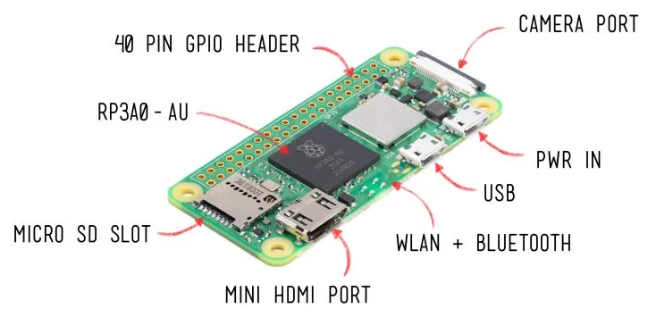
  </p>

  <p align="center">
    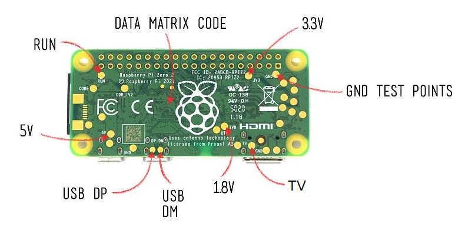
  </p>

  > ![Info][img-info] Images courtesy of [pi3g][url-pi3g]
</details>

<p align="right">[ <a href="#index">Index</a> ]</p>

<!---------------------------------------------------------------------------->
<!---------------------------------------------------------------------------->
<!---------------------------------------------------------------------------->

## Raspberry Pi Zero 2 W OS Setup <a name="pi-os-setup"></a>

1. Download the Raspberry Pi Imager: https://www.raspberrypi.com/software/

2. Plug the microSD card into the computer and open the Raspberry Pi Imager.

3. We'll install the full [Raspberry Pi Legacy OS (Bullseye, not ~~Bookworm~~, 32-bit)][url-pi-os] in this example so we can take advantage of our massive 1.3inch IPS LCD display HAT:

  > ![Info][img-info] Before installation enable SSH, take note of the hostname, set the username and password for the Raspberry Pi Zero, and set up your connection to the Wi-Fi network.

<details>
  <summary>Installation Images (click to expand)</summary>

  <p align="center">
    <br/><br/>
    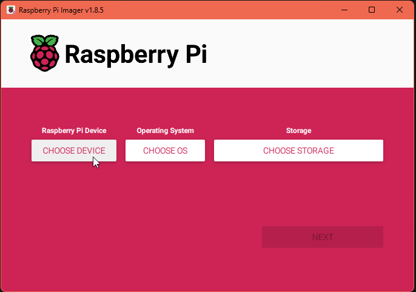
    <br/>
    Select "Raspberry Pi Zero 2 W" from the list of devices.
    <br/>
    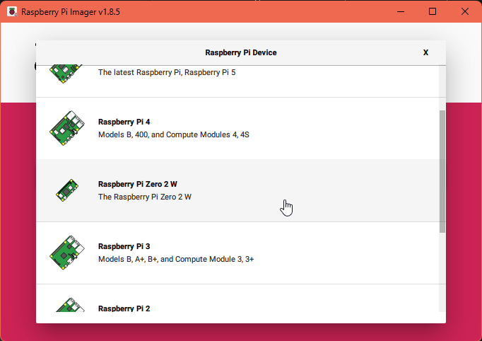
    <br/>
    Select "Raspberry Pi OS (Legacy, 32-bit)" from the list of operating systems.
    <br/>
    Or the "Use custom" if you download the OS image from the Raspberry Pi website directly from above.
    <br/>
    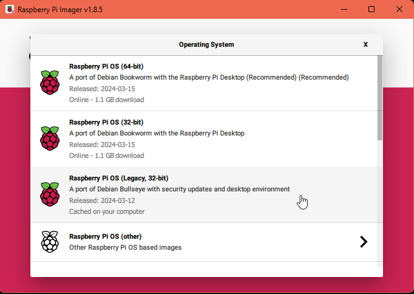
    <br/>
    Choose your storage device.
    <br/>
    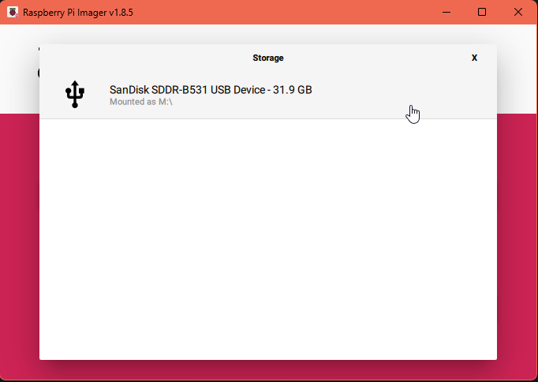
    <br/>
    Click "Next" to start the installation process.
    <br/>
    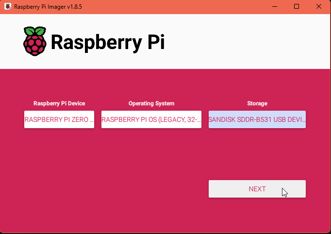
    <br/>
    When the installer asks if you want to customize the installation, click "Yes". Enter your custom hostname, username, and password if you'd like, you'll use these later so take note of them.
    <br/>
    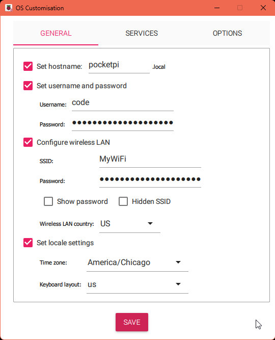
    <br/>
    The second customization screen allows you to set up SSH. Enable SSH and press "Save".
    <br/>
    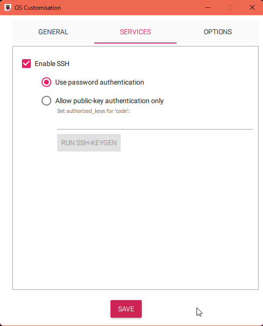
    <br/>
    <br/>
    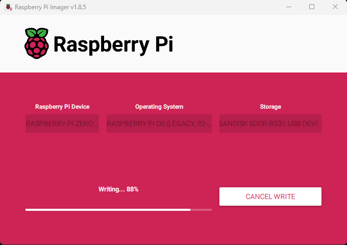
    <br/>
    The installation is completed, but keep your microSD card in the computer for the next few steps.
    <br/>
    
  </p>
</details>

<p align="right">[ <a href="#index">Index</a> ]</p>

<!---------------------------------------------------------------------------->
<!---------------------------------------------------------------------------->
<!---------------------------------------------------------------------------->

## MicroSD Card Setup & PC Connection (SSH) <a name="sd-card-setup-and-pc-connection"></a>

Copy the files from the `bootfs` folder at the root of this repository onto the newly created microSD card `bootfs` partition. This will enable SSH, Ethernet over USB, and configure the display settings for the 1.3inch IPS LCD display HAT. Be sure to overwrite any existing files on the microSD card. If you would like to do this manually, follow the steps below:

1. With the microSD card still in your computer, open the `config.txt` file and modify to match the following settings:

  ```bash
  [all]
  hdmi_force_hotplug=1
  hdmi_cvt=300 300 60 1 0 0 0
  hdmi_group=2
  hdmi_mode=87
  display_rotate=0
  gpio=6,19,5,26,13,21,20,16=pu
  ```

  > ![Info][img-info] Comment out or remove everything prefixed with a `dtoverlay=` and `dtparam=`.

2. Save and close `config.txt`. 

3. In the same directory, open the file `cmdline.txt` and add `modules-load=dwc2,g_ether` after `rootwait`. Ensure it remains a single line of text, and has proper spacing. For example:

  ```bash
  ... rootwait modules-load=dwc2,g_ether ...
  ```

  > ![Info][img-info] This is part of enabling SSH and Ethernet over USB.

4. Save and close `cmdline.txt`. 

5. Create a new file named `ssh` in the root of the microSD card. This is part of enabling SSH on the Raspberry Pi Zero.

6. Remove the microSD card from the computer and insert it into the Raspberry Pi Zero.

7. Plug the Raspberry Pi Zero into the computer using a USB cable. Connect the cable to the USB port in the center of the Raspberry Pi Zero labeled `USB`. The green LED will light up, indicating the Raspberry Pi Zero is powered on. 

8. You should now be able to connect to your Pi using SSH in a CLI:

  ```bash
  # Replace "code@pocketpi.local" with your own `hostname` and `username`.
  ssh code@pocketpi.local
  ```

  > ![Info][img-info] It may take a minute for the Pi Zero to connect. If you are prompted to accept the host key, type `yes` and press `Enter`. You will then be prompted for the password you set during the installation.

<p align="right">[ <a href="#index">Index</a> ]</p>

<!---------------------------------------------------------------------------->
<!---------------------------------------------------------------------------->
<!---------------------------------------------------------------------------->

## Increasing Swap Size <a name="increasing-swap-size"></a>

Increasing the swap size can help speed up the installation process and various other things. This is especially useful when installing software that requires a lot of memory, such as the Raspberry Pi OS update and upgrade process. The default swap size is 100MiB, which is not enough for some installations. Below we will change this to 2GiB (2048MiB). To do this, follow these steps:

  > ![Info][img-info] You can revert this at a later point if you wish or keep it. See "Reverting back to 100MiB" below.

  ```bash
  # Check current swap size (you should see 100MiB or 99MiB for "Swap total")
  free -h
  # Disable current swap
  sudo dphys-swapfile swapoff
  # Set the swap file size to 2048MiB, or 2GiB
  sudo sed -i 's/^CONF_SWAPSIZE=.*/CONF_SWAPSIZE=2048/' /etc/dphys-swapfile
  # Recreate the swap file with the new size
  sudo dphys-swapfile setup
  # Enable the new swap size
  sudo dphys-swapfile swapon
  # Reboot
  sudo reboot
  # Reconnect to the Raspberry Pi Zero
  ssh code@pocketpi.local
  # Verify the new swap size (should be 2048MiB, or 2GiB)
  free -h
  ```

<details>
  <summary>Reverting back to 100MiB (click to expand)</summary>

  ```bash
  # Disable current swap
  sudo dphys-swapfile swapoff
  # Set the swap file size back to 100MiB
  sudo sed -i 's/^CONF_SWAPSIZE=.*/CONF_SWAPSIZE=100/' /etc/dphys-swapfile
  # Recreate the swap file with the original size
  sudo dphys-swapfile setup
  # Enable the original swap size
  sudo dphys-swapfile swapon
  # Reboot
  sudo reboot
  # Reconnect to the Raspberry Pi Zero
  ssh code@pocketpi.local
  # Verify the reverted swap size (you should be 100MiB or 99MiB)
  free -h
  ```
</details>

<p align="right">[ <a href="#index">Index</a> ]</p>

<!---------------------------------------------------------------------------->
<!---------------------------------------------------------------------------->
<!---------------------------------------------------------------------------->

## Updating & Upgrading <a name="updating-upgrading"></a>

In this section we will update and upgrade the Raspberry Pi Zero to ensure we have the latest software and security updates.

1. Open the terminal and run the following command to access the Raspberry Pi Zero. Using the hostname and the username and password you set during the installation:

  ```bash
  ssh code@pocketpi.local
  ```

2. Update & upgrade the system (the y flag will automatically answer yes to any prompts)

  ```bash
  sudo apt-get update && sudo apt-get full-upgrade -y
  ```

3. Reboot the Raspberry Pi Zero

  ```bash
  sudo reboot
  ```

<p align="right">[ <a href="#index">Index</a> ]</p>

<!---------------------------------------------------------------------------->
<!---------------------------------------------------------------------------->
<!---------------------------------------------------------------------------->

## Screen Module Setup <a name="screen-module-setup"></a>

**240x240, 1.3inch IPS LCD display HAT**

Purchase: 

- [https://www.pishop.us/product/240x240-1-3inch-ips-lcd-display-hat-for-raspberry-pi/][url-pi-lcd-hat]

Documentation: 

- https://www.waveshare.com/wiki/1.3inch_LCD_HAT

### Pi OS Configuration

Connect to the Raspberry Pi Zero via SSH:

  ```bash
  ssh code@pocketpi.local
  ```

Run the following commands to enable the SPI interface. It should already be enabled if you followed the SD card setup, but it's good to make sure.

  ```bash
  sudo raspi-config
  Choose Interface Options -> SPI -> Yes
  ```

<details>
  <summary>Config setup Images (click to expand)</summary>

  <p align="center">
    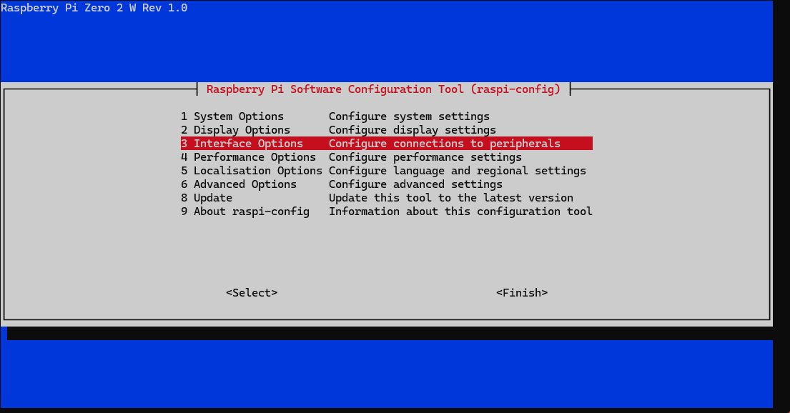
  </p>

  <p align="center">
    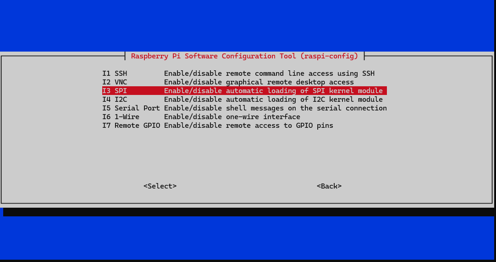
  </p>

  <p align="center">
    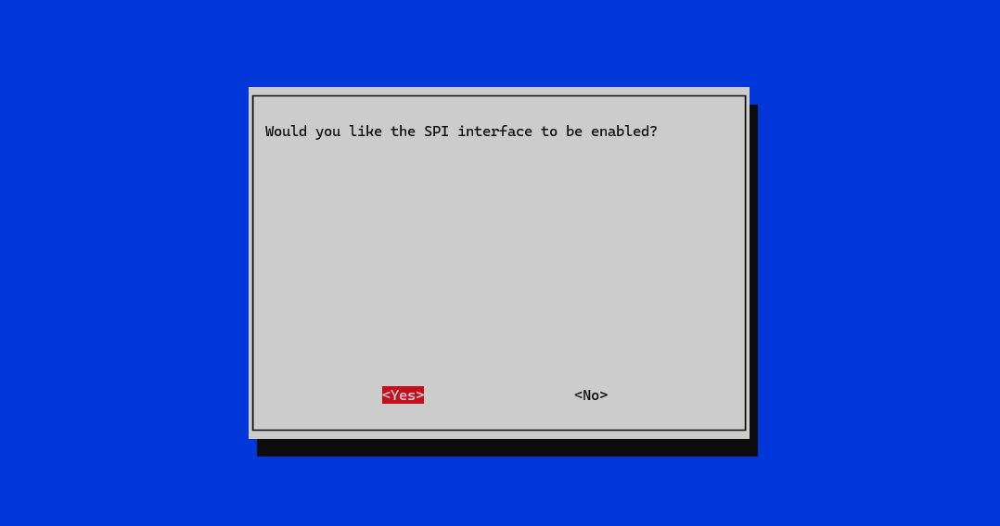
  </p>

  <p align="center">
    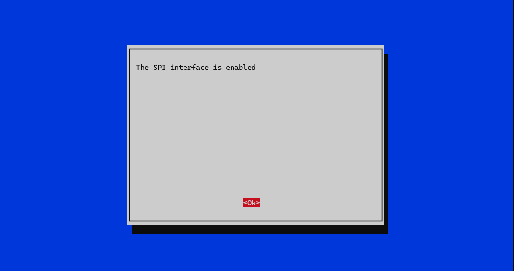
  </p>

  <p align="center">
    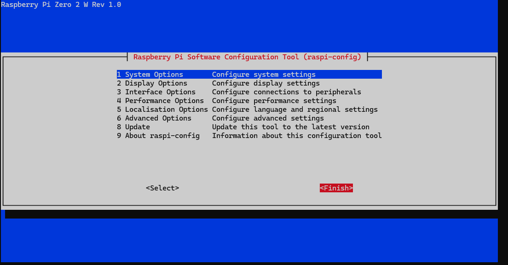
  </p>
</details>

Ensure your user has the necessary permissions to access the SPI device:

  ```bash
  sudo usermod -aG spi,gpio $(whoami)
  ```

Install fbcp driver for the screen:

  ```bash
  cd ~
  sudo apt-get install cmake -y
  git clone https://github.com/juj/fbcp-ili9341.git
  cd fbcp-ili9341
  mkdir build
  cd build
  cmake -DSPI_BUS_CLOCK_DIVISOR=6 -DWAVESHARE_ST7789VW_HAT=ON -DBACKLIGHT_CONTROL=ON ..
  make -j
  ```

Reboot Raspberry Pi：
  
  ```bash
  sudo reboot
  # Reconnect to the Raspberry Pi Zero
  ssh code@pocketpi.local
  ```

To auto-start when powered on, open the `/etc/rc.local` file for edit:

  ```bash
  sudo nano /etc/rc.local
  ```

And add the following line just above and before `exit 0`:

  ```bash
  sudo /home/code/fbcp-ili9341/build/fbcp-ili9341 &
  ```

> ![Info][img-info] Replace `code` in the last example with your `username`.

After you're done making edits press `CTRL + O`, then `ENTER`, and then `CTRL + X` to exit. Reboot the Raspberry Pi Zero:

  ```bash
  sudo reboot
  # Reconnect to the Raspberry Pi Zero
  ssh code@pocketpi.local
  ```

<p align="right">[ <a href="#index">Index</a> ]</p>

<!---------------------------------------------------------------------------->
<!---------------------------------------------------------------------------->
<!---------------------------------------------------------------------------->

## Joystick and Buttons Setup <a name="joystick-and-buttons-setup"></a>

Install the necessary software to use the joystick and buttons:

  ```bash
  sudo apt-get install python3-xlib
  sudo pip3 install PyMouse
  sudo pip3 install unix
  sudo pip3 install PyUserInput
  wget http://www.waveshare.net/w/upload/d/d3/Mouse.7z
  7z x Mouse.7z
  sudo python3 mouse.py
  ```

Set the auto-start when power on:

  ```bash
  cd ~/.config/
  mkdir autostart
  cd autostart/
  sudo nano local.desktop
  ```

Add the following lines at the end of the `local.desktop` file:

  ```bash
  [Desktop Entry]
  Type=Application
  Exec=python3 /home/code/mouse.py
  ```

  > ![Info][img-info] Replace `code` in the last example with your `username`.

Press `CTRL + O`, then `ENTER`, and then `CTRL + X` to exit. Reboot the Raspberry Pi Zero:

  ```bash
  sudo reboot
  ```

You should now be able to use the joystick and buttons to move the mouse cursor and click on the screen.

<p align="right">[ <a href="#index">Index</a> ]</p>

<!---------------------------------------------------------------------------->
<!---------------------------------------------------------------------------->
<!---------------------------------------------------------------------------->

## Battery Module Setup <a name="battery-module-setup"></a>

**Uninterruptible Power Supply UPS HAT**

Purchase: 

- [https://www.pishop.us/product/uninterruptible-power-supply-ups-hat-for-raspberry-pi-zero-stable-5v-power-output/][url-pi-power-supply]

Documentation: 

- https://www.waveshare.com/wiki/UPS_HAT_(C)

### Pi OS Configuration

Run the following commands to enable the I2C interface. It should already be enabled if you followed the SD card setup, but it's good to make sure.

  ```bash
  sudo raspi-config 
  Choose Interfacing Options -> I2C -> Yes
  ```

<details>
  <summary>Config setup Images (click to expand)</summary>

  <p align="center">
    
  </p>

  <p align="center">
    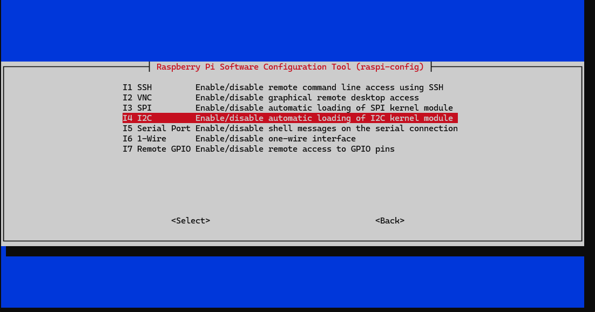
  </p>

  <p align="center">
    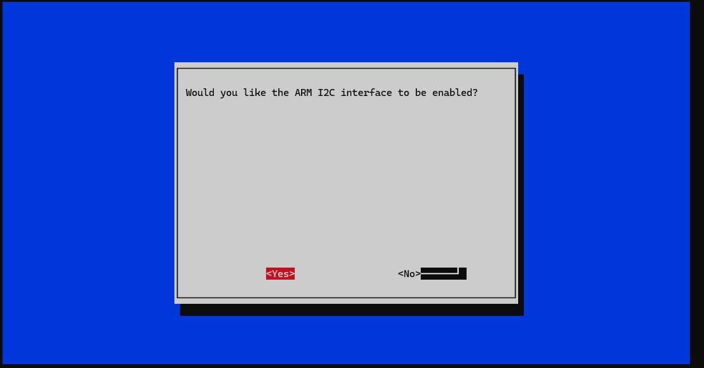
  </p>

  <p align="center">
    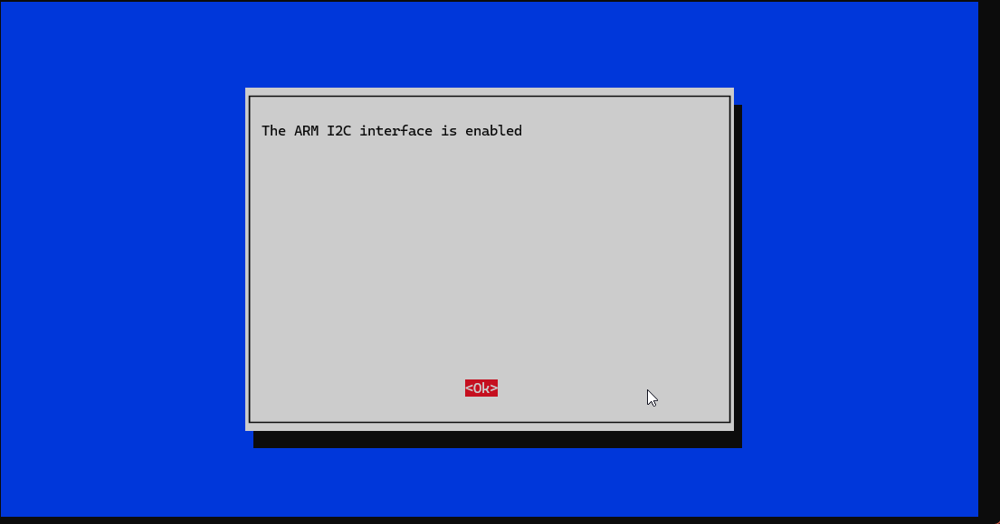
  </p>

  <p align="center">
    
  </p>
</details>

Then reboot the Pi Zero:

  ```bash
  sudo reboot
  # Reconnect to the Raspberry Pi Zero
  ssh code@pocketpi.local
  ```

### Software Installation

  ```bash
  # Download the UPS HAT software archive from the Waveshare website
  wget https://files.waveshare.com/upload/4/40/UPS_HAT_C.7z

  # Extract the downloaded 7z archive to the current directory
  7zr x UPS_HAT_C.7z -r -o./
  ```

### Run the UPS HAT software

  ```bash
  # Change directory to the newly created directory containing the extracted files
  cd UPS_HAT_C

  # Run the Python script named 'INA219.py', which typically handles the monitoring of the UPS
  python3 INA219.py
  ```

  > ![Info][img-info] If the current value is negative, it means that the batteries are feeding the Raspberry Pi. If the current value is positive, it means that the batteries are charging.

<p align="right">[ <a href="#index">Index</a> ]</p>

<!---------------------------------------------------------------------------->
<!---------------------------------------------------------------------------->
<!---------------------------------------------------------------------------->

## Licensing <a name="licensing"></a>

This project is licensed under the Apache License, Version 2.0. See the [APACHE_2_LICENSE](LICENSE) file for the pertaining license text.

`SPDX-License-Identifier: Apache-2.0`

<p align="right">[ <a href="#index">Index</a> ]</p>

<!---------------------------------------------------------------------------->
<!---------------------------------------------------------------------------->
<!---------------------------------------------------------------------------->

## Useful Commands <a name="useful-commands"></a>

Edit the `config.txt` file:

  ```bash
  sudo nano /boot/config.txt
  ```

<p align="right">[ <a href="#index">Index</a> ]</p>

<!---------------------------------------------------------------------------->
<!---------------------------------------------------------------------------->
<!---------------------------------------------------------------------------->

## Wrapping Up <a name="wrapping-up"></a>

Thanks to all the people and projects that made this possible! I hope you enjoy this project as much as I enjoyed working on it. If you have any questions, please let me know by opening an issue [here][issues-link].

| Type                                                                      | Info                                                                      |
| :------------------------------------------------------------------------ | :------------------------------------------------------------------------ |
|                 | webmaster@codytolene.com                                                  |
|      | https://www.buymeacoffee.com/codytolene                                   |
|  | [bc1qfx3lvspkj0q077u3gnrnxqkqwyvcku2nml86wmudy7yf2u8edmqq0a5vnt][url-btc] |

Fin. Happy programming friend!

Cody Tolene

<!---------------------------------------------------------------------------->
<!---------------------------------------------------------------------------->
<!---------------------------------------------------------------------------->

<!-- IMAGE REFERENCES -->

[img-info]: .github/images/ng-icons/info.svg
[img-warning]: .github/images/ng-icons/warn.svg

<!-- LINK REFERENCES -->

[url-btc]: https://explorer.btc.com/btc/address/bc1qfx3lvspkj0q077u3gnrnxqkqwyvcku2nml86wmudy7yf2u8edmqq0a5vnt
[url-pi-lcd-hat]: https://www.pishop.us/product/240x240-1-3inch-ips-lcd-display-hat-for-raspberry-pi/
[url-pi-os]: https://downloads.raspberrypi.com/raspios_oldstable_armhf/images/raspios_oldstable_armhf-2024-03-12/2024-03-12-raspios-bullseye-armhf.img.xz
[url-pi-power-supply]: https://www.pishop.us/product/uninterruptible-power-supply-ups-hat-for-raspberry-pi-zero-stable-5v-power-output/
[url-pi-zero]: https://www.pishop.us/product/raspberry-pi-zero-2-w/
[url-pi3g]: https://www.pi3g.com

<!---------------------------------------------------------------------------->
<!---------------------------------------------------------------------------->
<!---------------------------------------------------------------------------->
